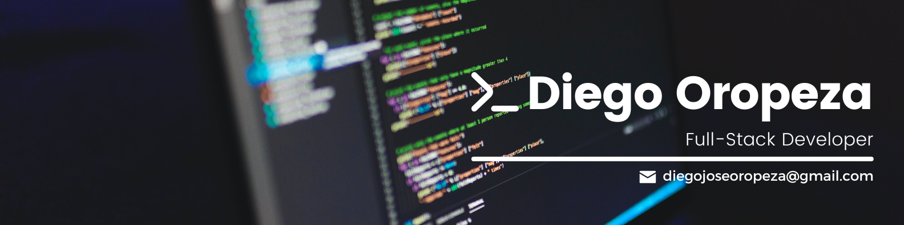

 
<h1 align="center"> 👋 Hi there! I'm Diego Oropeza (MrRobot_586) </h1>

  Full-stack web developer 🧑‍💻 | Computer engineering student 🤓 with a persistent attitude to achieve my goals 🎯.
   
  My current goal is to become a fulls-tack web development professional, specialized in React.js, Node and Express 🔥.
   
  🌱 I’m currently learning the MERN stack (MongoDB, Express, React and Node)

<!--
**MrRobot586/MrRobot586** is a ✨ _special_ ✨ repository because its `README.md` (this file) appears on your GitHub profile.

Here are some ideas to get you started:

- 🔭 I’m currently working on ...
- 🌱 I’m currently learning ...
- 👯 I’m looking to collaborate on ...
- 🤔 I’m looking for help with ...
- 💬 Ask me about ...
- 📫 How to reach me: ...
- 😄 Pronouns: ...
- ⚡ Fun fact: ...
-->
